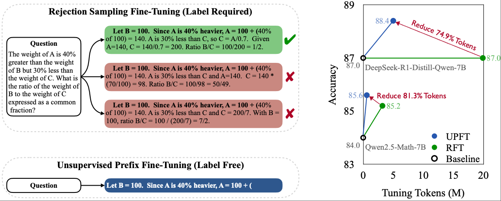

# The First Few Tokens Are All You Need: An Efficient and Effective Unsupervised Prefix Fine-Tuning Method for Reasoning Models

Are expensive labeled data and rejection sampling truly necessary for developing self-improving reasoning models?

We introduce Unsupervised Prefix Fine-Tuning (UPFT) -- an efficient method that trains models on only the first few tokens of single self-generated solutions, exploiting Prefix Self-Consistency across different reasoning trajectories.
This repo contains the source code of UPFT.

**The First Few Tokens Are All You Need: An Efficient and Effective Unsupervised Prefix Fine-Tuning Method for Reasoning Models** <br>
*Ke Ji, Jiahao Xu, Tian Liang, Qiuzhi Liu, Zhiwei He, Xingyu Chen, Xiaoyuan Liu, Zhijie Wang, Junying Chen, Benyou Wang, Zhaopeng Tu, Haitao Mi, Dong Yu* <br>
Paper: https://arxiv.org/abs/2503.02875 <br>


<p align="center">

</p>

The experiment results under the unsupervised sampling settings:

| Fine-Tuning Method | Data          | Avg. Length | GSM8K | MATH500 | AIME2024 | GPQA | Ave. |
| -------------------- |---------------| ------------- | ------- | --------- | ---------- | ------ | ------ |
| **Llama-3.1-8B-Instruct**                   |               |             | 82.0  | 51.0    | 3.3      | 8.6  | 36.2 |
| + SFT              | PRM (12K)     | 175.8       | 83.8  | 48.4    | 3.3      | 8.6  | 36.0 |
| + UPFT             | PRM (12K)     | 15.8        | 85.4  | 52.0    | 6.7      | 9.1  | **38.3**     |
| **Qwen2.5-Math-7B-Instruct**                   |               |             | 95.2  | 84.0    | 16.7     | 9.6  | 51.4 |
| + SFT              | PRM (12K)     | 300.1       | 95.8  | 83.4    | 13.3     | 9.1  | 50.4 |
| + UPFT             | PRM (12K)     | 51.4        | 95.5  | 85.6    | 20.0     | 9.6  | **52.6**     |
| + SFT              | OMI2 (600K)   | 533.2       | 95.4  | 83.4    | 13.3     | 6.6  | 49.7 |
| + UPFT             | OMI2 (600K)   | 67.5        | 95.4  | 86.4    | 20.0     | 9.6  | **52.9**     |
| + SFT              | LIMO          | 491.8       | 95.8  | 84.2    | 20.0     | 7.6  | 51.9 |
| + UPFT             | LIMO (0.8K)   | 77.8        | 95.6  | 85.8    | 20.0     | 8.6  | **52.5**     |
| + SFT              | U-Hard        | 393.3       | 95.5  | 83.4    | 16.7     | 9.6  | 51.3 |
| + UPFT             | U-Hard (100K) | 68.2        | 96.0  | 85.6    | 26.6     | 9.6  | **54.5**     |
| **DeepSeek-R1-Distill-Qwen-7B**                   |               |             | 88.6  | 87.0    | 40.0     | 13.1 | 57.2 |
| + SFT              | LIMO (0.8K)   | 2029.5      | 89.7  | 87.0    | 40.0     | 12.1 | 57.2 |
| + UPFT             | LIMO (0.8K)   | 757.7       | 92.0  | 89.4    | 43.3     | 17.7 | **60.6**     |
| + SFT              | U-Hard (100K) | 3440.4      | 89.7  | 87.0    | 36.7     | 12.1 | 56.4 |
| + UPFT             | U-Hard (100K) | 561.7       | 91.4  | 89.2    | 50.0     | 15.7 | **61.6**     |

For supervised sampling settings:

| Method         | #Tokens<br /> |        | GSM8K | MATH500 | AIME2024 | GPQA | Avg. |
| ---------------- | :---------: |--------| ------- | --------- | ---------- | ------ | ------ |
|                | Sampling | Tuning |       |         |          |      |      |
| **Llama-3.1-8B-Instruct**               |          |        | 82.0  | 51.0    | 3.3      | 8.6  | 36.2 |
| + RFT          |   36.9M   | 2.3M   | 86.0  | 52.0    | 6.7      | 9.1  | 38.5 |
| + V-STaR       |   36.9M   | 6.8M   | 85.4  | 52.6    | 6.7      | 8.6  | 38.3 |
| + UPFT (Ours)  |  0.2M<br />  | 0.2M   | 85.4  | 52.0    | 6.7      | 9.1  | 38.3 |
| + Lable Filter |   36.9M   | 0.2M   | 85.8  | 53.4    | 6.7      | 9.1  | 38.8 |
| **Qwen2.5-Math-7B-Instruct**               |          |        | 95.2  | 84.0    | 16.7     | 9.6  | 51.4 |
| + RFT          |   51.7M   | 3.2M   | 95.7  | 85.2    | 20.0     | 9.6  | 52.6 |
| + V-STaR       |   51.7M   | 9.6M   | 96.0  | 85.4    | 20.0     | 10.1 | 52.9 |
| + UPFT (Ours)  |  0.6M<br />  | 0.6M   | 95.5  | 85.6    | 20.0     | 9.6  | 52.6 |
| + Lable Filter |   51.7M   | 0.6M   | 96.0  | 85.6    | 20.0     | 10.1 | 52.9 |
| **DeepSeek-R1-Distill-Qwen-7B**               |          |        | 88.6  | 87.0    | 40.0     | 13.1 | 57.2 |
| + RFT          |  318.0M  | 19.9M  | 90.7  | 87.0    | 40.0     | 11.1 | 57.2 |
| + UPFT (Ours)  |  5.0M<br />  | 5.0M   | 91.9  | 88.4    | 40.0     | 14.6 | 58.7 |
| + Lable Filter |  318.0M  | 4.5M   | 92.3  | 89.2    | 40.0     | 13.6 | 58.8 |

Supervised experiments show that our method still achieves competitive performance under settings with label filtering, while reducing the number of training tokens by 75%.

## Getting Started

```bash
git clone https://github.com/1KE-JI/UPFT.git
cd UPFT
conda create -n torch240 python==3.10.13
conda activate torch240
pip install -r requirements.txt
```

### Training

We utilize open-source framework OpenRLHF to conduct our training process.

Step 1: Use vllm for sampling

Step 2: Run command below to train from a 7B model. 

```bash
bash scripts/train_sft.sh
```

## Citation

```bash
@article{ji2025first,
  title={The first few tokens are all you need: An efficient and effective unsupervised prefix fine-tuning method for reasoning models},
  author={Ji, Ke and Xu, Jiahao and Liang, Tian and Liu, Qiuzhi and He, Zhiwei and Chen, Xingyu and Liu, Xiaoyuan and Wang, Zhijie and Chen, Junying and Wang, Benyou and others},
  journal={arXiv preprint arXiv:2503.02875},
  year={2025}
}
```
