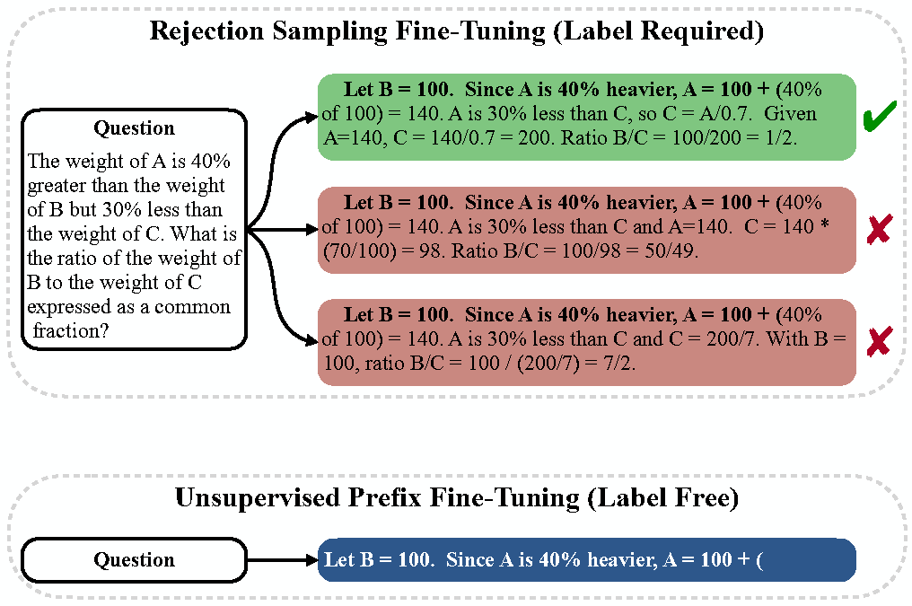

<div align="center">

[//]: # (  <h1>The First Few Tokens Are All You Need: An Efficient and Effective <span style="color:green;"><em>Unsupervised</em></span> <span style="color:blue;"><em>Prefix</em></span> Fine-Tuning Method for Reasoning Models</h1>)
<h1>
The First Few Tokens Are All You Need: An Efficient and Effective Unsupervised Prefix Fine-Tuning Method for Reasoning Models
</h1>
    <p>
    </p>
</div>

This repository provides official resources for the paper ["The First Few Tokens Are All You Need: An Efficient and Effective Unsupervised Prefix Fine-Tuning Method for Reasoning Models"](https://arxiv.org/abs/2503.02875).

<p align="center">

</p>

## Getting Started

```bash
git clone https://github.com/1KE-JI/UPFT.git
cd UPFT
conda create -n torch240 python==3.10.13
conda activate torch240
pip install -r requirements.txt
```

### Training

We utilize open-source framework OpenRLHF to conduct our training process.

Step 1: Use vllm for sampling

Step 2: Run command below to train from a 7B model on 8 A100 GPUs. 

```bash
bash scripts/train_sft.sh
```

## Citation

```bash
@article{ji2025first,
  title={The first few tokens are all you need: An efficient and effective unsupervised prefix fine-tuning method for reasoning models},
  author={Ji, Ke and Xu, Jiahao and Liang, Tian and Liu, Qiuzhi and He, Zhiwei and Chen, Xingyu and Liu, Xiaoyuan and Wang, Zhijie and Chen, Junying and Wang, Benyou and others},
  journal={arXiv preprint arXiv:2503.02875},
  year={2025}
}
```
